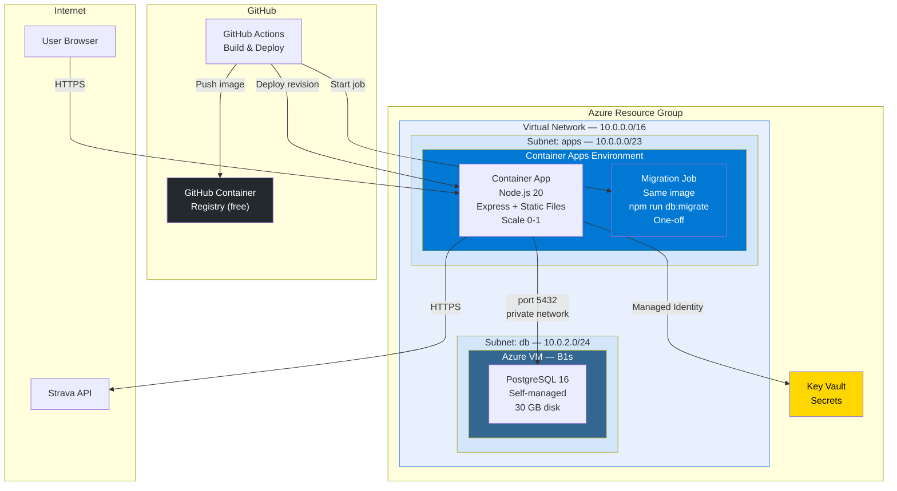

# Azure Architecture — Zync

## Decision: Container Apps + Self-Managed PostgreSQL on VM

Container Apps for compute (scale-to-zero, Docker-native), PostgreSQL on a small Azure VM for the database (cheapest option, good Azure practice). Both connected via a VNET — the VM has no public IP.

## Architecture



## Components

| Component | Service | SKU | Cost/mo |
|-----------|---------|-----|---------|
| **Compute** | Container Apps | Consumption (0.5 vCPU, 1 Gi) | ~$2-3 |
| **Database** | Azure VM (B1s) + PostgreSQL | 1 vCPU, 1 GB RAM, 30 GB disk | ~$4 |
| **Network** | VNET + 2 subnets + NSG | — | $0 |
| **Registry** | GitHub Container Registry | Free (private repos) | $0 |
| **Migrations** | Container App Job | Same image, one-off | $0 |
| **Secrets** | Key Vault | Standard | ~$0 |
| **Total** | | | **~$6-7/mo** |

## Why This Setup

### Container Apps for compute
- **Scale to zero** — ~$0 when idle, pay only for active requests
- **Docker-native** — clean, reproducible builds
- **Built-in HTTPS** — automatic TLS on ingress endpoint
- **VNET integration** — free, unlike App Service where it requires Standard tier ($55/mo)

### Self-managed PostgreSQL on VM
- **~$4/mo** vs ~$13/mo for managed Flexible Server
- **Full control** — configure, tune, backup on your own terms
- **Azure practice** — learn VM provisioning, networking, cloud-init, NSG rules
- **B1s VM** — 1 vCPU, 1 GB RAM, burstable. More than enough for a single-user app

### Trade-offs of self-managed
- You handle PostgreSQL updates, backups, and monitoring
- No automatic failover or point-in-time recovery
- If the VM dies, you restore from backup manually
- For a personal project, this is perfectly acceptable

## Networking

Container Apps and the VM must be on the same VNET for private connectivity. Without it, the VM would need a public IP with port 5432 exposed to the internet.

### VNET layout

```
10.0.0.0/16 — zync-vnet
├── 10.0.0.0/23 — apps subnet (Container Apps requires /23 minimum)
└── 10.0.2.0/24 — db subnet (VM)
```

### Network Security Group (on db subnet)

| Priority | Direction | Port | Source | Action | Purpose |
|----------|-----------|------|--------|--------|---------|
| 100 | Inbound | 5432 | 10.0.0.0/23 | Allow | PostgreSQL from Container Apps |
| 200 | Inbound | 22 | (your IP) | Allow | SSH for maintenance (optional) |
| 1000 | Inbound | * | * | Deny | Block everything else |

### Key points
- **VM has no public IP** — only reachable from within the VNET
- **Container Apps Environment** deployed into the apps subnet — gets private outbound through the VNET
- **PostgreSQL listens on `10.0.2.x:5432`** — the Container App connects using the VM's private IP
- **SSH access** only when needed, from a specific IP (or use Azure Bastion)
- **VNET is free** — no additional cost on Azure

## VM Setup (two-phase, no plaintext secrets)

### Phase 1: cloud-init (first boot)

Installs PostgreSQL only. No users, no passwords, no network access — just the software.

```yaml
# cloud-init.yaml
package_update: true
packages:
  - postgresql-16
  - postgresql-client-16
  - jq

runcmd:
  - systemctl enable postgresql
  - systemctl start postgresql
```

At this point PostgreSQL only accepts local peer connections from the `postgres` OS user. No secrets exist anywhere on disk.

### Phase 2: VM Extension (after Key Vault + managed identity are ready)

Terraform's `azurerm_virtual_machine_extension` runs a script inside the VM after all dependencies are provisioned. The VM uses its managed identity to fetch the password from Key Vault — no credentials stored anywhere.

```bash
#!/bin/bash
# configure-postgres.sh (runs via VM Extension)

# Fetch DB password from Key Vault using VM's managed identity
# The managed identity authenticates via Azure Instance Metadata Service — no secrets needed
TOKEN=$(curl -s 'http://169.254.169.254/metadata/identity/oauth2/token?api-version=2018-02-01&resource=https://vault.azure.net' -H 'Metadata: true' | jq -r '.access_token')
DB_PASSWORD=$(curl -s "https://zync-kv.vault.azure.net/secrets/db-password?api-version=7.4" -H "Authorization: Bearer $TOKEN" | jq -r '.value')

# Create database user and database
sudo -u postgres psql -c "CREATE USER zync WITH PASSWORD '$DB_PASSWORD';"
sudo -u postgres psql -c "CREATE DATABASE zync OWNER zync;"

# Open network access for Container Apps subnet only
echo "listen_addresses = '*'" >> /etc/postgresql/16/main/postgresql.conf
echo "host zync zync 10.0.0.0/23 scram-sha-256" >> /etc/postgresql/16/main/pg_hba.conf

systemctl restart postgresql
```

### Why two phases?

| | cloud-init | VM Extension |
|---|---|---|
| **When** | First boot, before other resources exist | After Terraform creates Key Vault + identity |
| **Secrets** | None — just installs packages | Fetches password from Key Vault at runtime |
| **Logs** | Safe to inspect (`/var/log/cloud-init-output.log`) | Password only in memory during script execution |
| **Terraform state** | No secrets | No secrets (only Key Vault reference) |

Note: `pg_hba.conf` only allows connections from the apps subnet CIDR (`10.0.0.0/23`), providing defense in depth beyond the NSG.

## Data Flow


## What's NOT Included (by design)

- **Custom domain** — Container Apps provides an HTTPS endpoint
- **Automated backups** — add pg_dump cron job later if needed
- **Monitoring / Application Insights** — add later if needed
- **Load balancer** — single instance, not needed
- **Azure Bastion** — SSH from specific IP via NSG rule is simpler

## Migration Steps

### 1. Migrate sessions from in-memory to PostgreSQL
- Add `sessions` table
- Rewrite `SessionStore` to use `pg` Pool instead of `Map`
- Sessions survive restarts, deploys, scale-to-zero

### 2. Migrate database from SQLite to PostgreSQL
- Replace `better-sqlite3` with `pg` (node-postgres)
- Rewrite SQL migrations (PostgreSQL syntax)
- Make database methods async
- Replace FTS5 with `tsvector` + GIN index
- Add connection pool

### 3. Dockerfile
- Multi-stage build: deps → build client + server → production image
- Node.js 20 Alpine base
- Migrations run via a one-off Container App job (same image, migration entrypoint), not on cold start

### 4. Backend: serve static frontend
- Express static middleware serves `client/dist/` in production

### 5. Terraform infrastructure
- Resource group
- VNET + 2 subnets (apps, db)
- NSG on db subnet (allow 5432 from apps subnet only)
- VM (B1s, no public IP) with cloud-init for PostgreSQL
- Container Apps environment (in apps subnet) + app + migration job
- Key Vault + secrets + managed identity

### 6. GitHub Actions pipeline
- Build Docker image → push to GHCR → `az containerapp job start` (migration) → wait for completion → deploy new Container Apps revision → health check

## Database Migrations (Container App Job)

Migrations run as a one-off Container App job — a separate container in the same VNET that runs migrations then exits. This is necessary because the PostgreSQL VM has no public IP and is only reachable from within the VNET.

### How it works
- **Same Docker image** as the main app, different command: `npm run db:migrate`
- **Triggered by GHA** via `az containerapp job start` during the deploy pipeline
- **Runs inside the VNET** — can reach PostgreSQL on its private IP
- **Fails fast** — non-zero exit code blocks the deploy (new revision is not created)
- **No cost** — Container App jobs only bill for execution time

### Deploy sequence
```
Build image → Push to GHCR → Start migration job → Wait for exit 0 → Deploy new app revision → Health check
```

If the migration job fails, the deploy stops. The previous app revision keeps running unchanged.

## Cost Optimization

- **Container Apps**: $0 when idle (scale-to-zero)
- **VM**: can't scale to zero, but B1s is ~$4/mo — cheap enough to leave running
- **Stop VM** during extended breaks: `az vm deallocate` (stops billing for compute, keeps disk)
- **VNET**: free — no additional cost
- **GHCR**: free for private repos
- Cost alerts at $10/mo threshold
