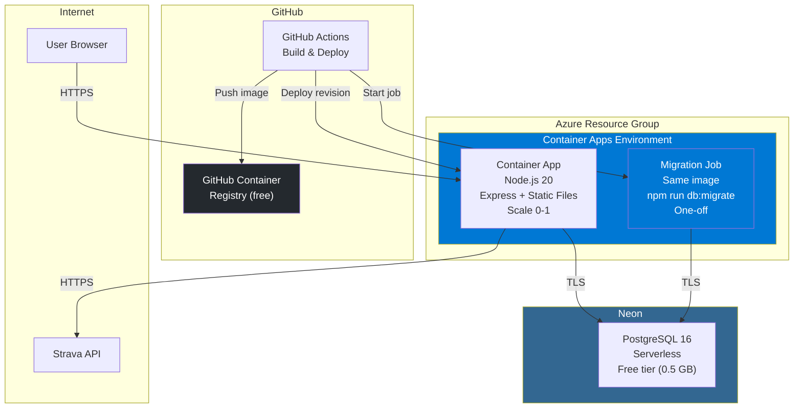
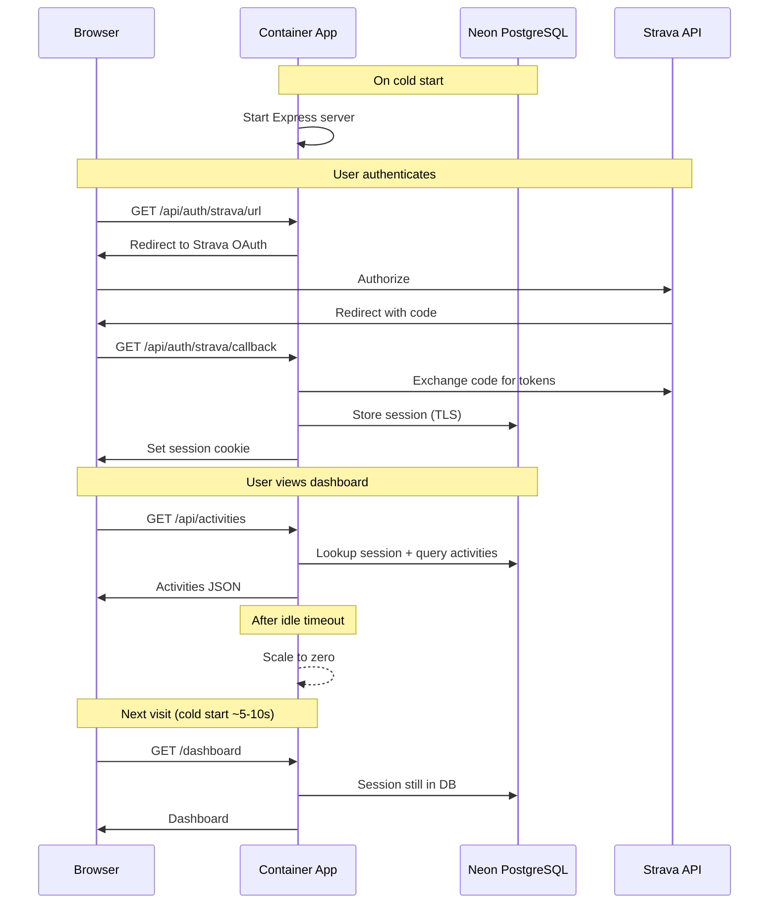

# Azure Architecture — Zync

## Decision: Container Apps + Neon PostgreSQL

Container Apps for compute (scale-to-zero, Docker-native), Neon for the database (free tier, serverless PostgreSQL, zero ops). No VM, no VNET, no Key Vault — just two managed services.

## Architecture



## Components

| Component | Service | Cost/mo |
|-----------|---------|---------|
| **Compute** | Container Apps (Consumption: 0.5 vCPU, 1 Gi) | ~$2-3 |
| **Database** | Neon free tier (0.5 GB storage, serverless) | $0 |
| **Registry** | GitHub Container Registry (free) | $0 |
| **Migrations** | Container App Job (same image, one-off) | $0 |
| **Total** | | **~$2-3/mo** |

## Why This Setup

### Container Apps for compute
- **Scale to zero** — ~$0 when idle, pay only for active requests
- **Docker-native** — clean, reproducible builds
- **Built-in HTTPS** — automatic TLS on ingress endpoint
- **No VNET needed** — Azure-managed networking is sufficient when the DB is external

### Neon for the database
- **Free tier** — 0.5 GB storage, 190 compute hours/mo. More than enough for a single-user app
- **Serverless PostgreSQL** — scales to zero like Container Apps
- **Zero ops** — no VM to maintain, no backups to configure, no patching
- **Standard PostgreSQL** — same connection string, same queries, same `pg` driver
- **Connection pooling** — built-in, important for serverless/scale-to-zero clients

### Trade-offs
- Database is outside Azure (external dependency)
- Free tier has limits (0.5 GB storage, 190 compute hours/mo) — fine for personal use
- Less "Azure practice" than self-managing PostgreSQL on a VM
- If Neon changes their free tier, migrate to Azure Flexible Server (~$13/mo) or another host

## Data Flow



## What's NOT Included (by design)

- **Custom domain** — Container Apps provides an HTTPS endpoint
- **Monitoring / Application Insights** — add later if needed
- **Azure VNET** — not needed when the DB is external
- **Azure Key Vault** — secrets are set via Terraform variables, stored in Container App secret store

## Migration Steps

### 1. Migrate sessions from in-memory to PostgreSQL
- Add `sessions` table
- Rewrite `SessionStore` to use `pg` Pool instead of `Map`
- Sessions survive restarts, deploys, scale-to-zero

### 2. Migrate database from SQLite to PostgreSQL
- Replace `better-sqlite3` with `pg` (node-postgres)
- Rewrite SQL migrations (PostgreSQL syntax)
- Make database methods async
- Replace FTS5 with `tsvector` + GIN index
- Add connection pool

### 3. Dockerfile
- Multi-stage build: deps → build client + server → production image
- Node.js 20 Alpine base
- Migrations run via a one-off Container App job (same image, migration entrypoint), not on cold start

### 4. Backend: serve static frontend
- Express static middleware serves `client/dist/` in production

### 5. Terraform infrastructure
- Resource group
- Container Apps Environment + app + migration job
- Secrets passed as Terraform variables (DATABASE_URL, STRAVA_CLIENT_SECRET, COOKIE_SECRET)

### 6. GitHub Actions pipeline
- Build Docker image → push to GHCR → `az containerapp job start` (migration) → wait for completion → deploy new Container Apps revision → health check

## Database Migrations (Container App Job)

Migrations run as a one-off Container App job that runs migrations then exits.

### How it works
- **Same Docker image** as the main app, different command: `npm run db:migrate`
- **Triggered by GHA** via `az containerapp job start` during the deploy pipeline
- **Connects to Neon** over TLS — no VNET needed
- **Fails fast** — non-zero exit code blocks the deploy (new revision is not created)
- **No cost** — Container App jobs only bill for execution time

### Deploy sequence
```
Build image → Push to GHCR → Start migration job → Wait for exit 0 → Deploy new app revision → Health check
```

If the migration job fails, the deploy stops. The previous app revision keeps running unchanged.

## Cost Optimization

- **Container Apps**: $0 when idle (scale-to-zero)
- **Neon**: $0 (free tier, also scales to zero)
- **GHCR**: free for private repos
- Total: **~$2-3/mo** during active use, **$0** when fully idle
